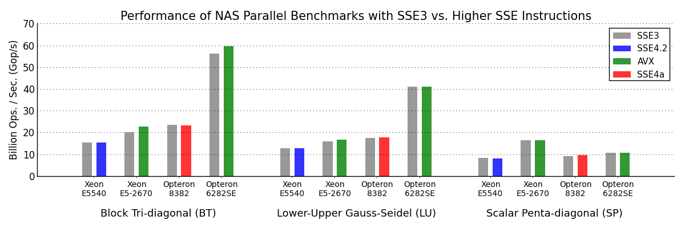

Performance of NAS Parallel Benchmarks with SSE3 vs. Higher SSE Instructions
============================================================================

## Methods

We tested four architectures on the Oscar cluster at CCV:

* Intel Xeon E5540 (Nehalem, SSE4.2, 8 cores)
* Intel Xeon E5-2670 (Sandy Bridge, AVX, 16 cores)
* AMD Opteron 8382 (Shanghai, SSE4a, 16 cores)
* AMD Opteron 6282SE (Interlagos, AVX, 64 cores)

All used the OpenMP version of the benchmarks, with `OMP_NUM_THREADS` set to
the total number of cores.  All builds for Intel CPUs used the `ifort` compiler
version (2011.11.339), and those for AMD CPUs used `gfortran` version 4.7.2.
Compiler flags were set to `-O3 -fopenmp` plus an appropriate SSE flag, e.g.
`-msse3` for `gfortran` or `-xSSE3` for `ifort`.

On each architecture, we compared an SSE3 and higher SSE version of the three
pseudo-applications in the NBP. For each psuedo-application and SSE condition,
we ran 10 trials and reported the trial with the maximum operations per second,
as reported in the `Mops/s total` field of the NBP output.

The `build.sh` script will build SSE3, SSE4.2, SSE4a, and AVX versions of the
three pseudo-applications (bt, sp, lu) from the OpenMP NAS Parallel Benchmarks.

The run.sh script will run 10 trials of the A problem size for two
different versions, e.g.

    ./run.sh 16 sse3 avx

where the first argument is the number of cores, and the next two arguments
are the directories containing the build variants.

## Results

On the Oscar cluster at CCV, we ran this script on the appropriate nodes to
generate four log files:

    ./run.sh 16 sse3-intel avx-intel >"Xeon E5-2670.txt"
    ./run.sh 8 sse3-intel sse4.2-intel >"Xeon E5540.txt"
    ./run.sh 16 sse3 sse4a >"Opteron 8382.txt"
    ./run.sh 64 sse3 avx >"Opteron 6282SE.txt"

These log files are included in this directory for reference.

This figure was generated from the included log files with the `plot.py` script:

    ./plot.py *.txt

This script picks the trial with the maximum performace.  It requires
matplotlib 1.2.0 and numpy 1.6.1.

### References

NASA Advanced Supercomputing Division. NAS Parallel Benchmarks 3.3.1
[http://www.nas.nasa.gov/publications/npb.html](http://www.nas.nasa.gov/publications/npb.html)
Retrieved April 29, 2013.

### Acknowledgments

This research was conducted using computational resources at the Center for
Computation and Visualization, Brown University.

